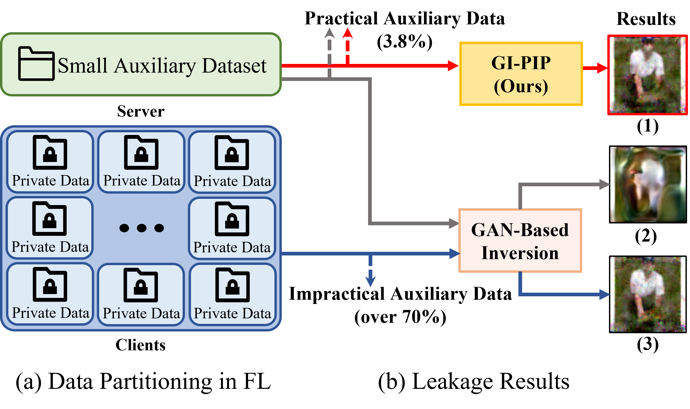
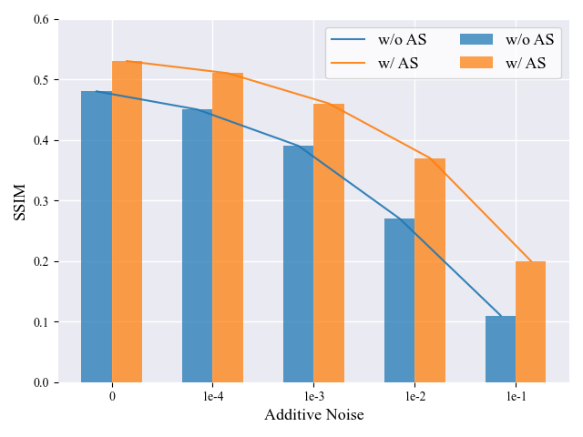
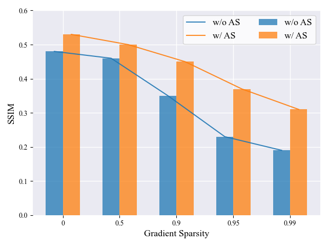
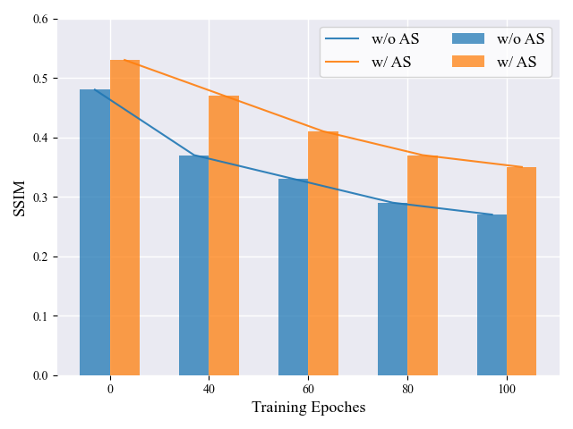
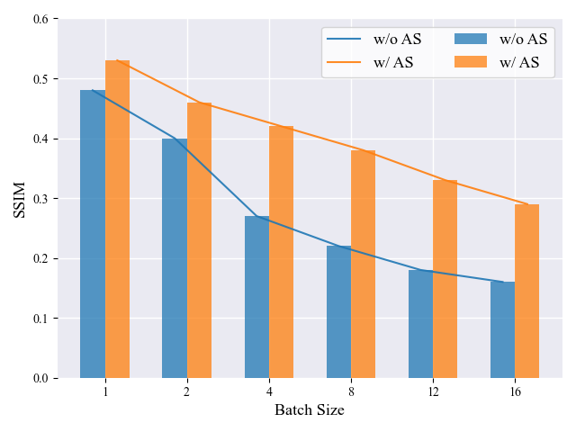

# GI-PIP: Do We Require Impractical Auxiliary Dataset for Gradient Inversion Attacks?<br>

The code for implementing our ***GI-PIP: Do We Require Impractical Auxiliary Dataset for Gradient Inversion Attacks?***



## Requirements

Our project is implemented based on PyTorch and basic Python environment. Here, we provide a simple instruction to configure the essential python libraries:

```bash
pip install -r requirements.txt
```
## Setup

### Dataset
You are supposed to download CIFAR-10, ImageNet or any dataset you want, and provide its location through the command line.

### Pretrained Generative Models
For Auto-Encoders implementation, we used:
* https://github.com/chenjie/PyTorch-CIFAR-10-autoencoder
* https://github.com/Horizon2333/imagenet-autoencoder

For Stylegan2 implementation, we used:
* https://github.com/NVlabs/stylegan2-ada-pytorch
* https://github.com/adriansahlman/stylegan2_pytorch

For DCGAN implementation, we used:
* https://github.com/csinva/gan-vae-pretrained-pytorch
* https://github.com/DmitryUlyanov/deep-image-prior

For Auto-Encoders used to generate Anomaly Score loss, you need to rename your model's file as `ae.pth`, and put it in `inversefed\AE_model\{dataset}`, for example: `inversefed\AE_model\CIFAR10\ae.pth`.

For DCGAN and StyleGAN2 used in GIAS,  put them under the corresponding folder in `inversefed/genmodels/`. Check `inversefed/porting.py` for more details. 

If you want to build your own network, please modify `inversefed/AE_model/models/builder.py` and add your own pytorch module here.

Specifically, for pytorch versions higher than v1.11, we have fixed it according to the following patch: 

* https://github.com/NVlabs/stylegan3/commit/407db86e6fe432540a22515310188288687858fa
* https://github.com/NVlabs/stylegan3/issues/188
## Running Expriments

### Basic Options
Main options are listed as follows:
| Option/Parameter | Help                                      |
|------------------|-------------------------------------------|
| dataset          | The dataset of experiments                |
| data_path        | The path of dataset                       |
| num_exp          | Number of consecutve experiments          |
| num_images       | Number of images recovered from gradients |
| lr               | Learning rate of optimizer                |
| model            | Global Model of FL                        |
| dataset          | Dataset of FL                             |
| tv               | Weight of TV loss                         |
| ano              | Weight of Anomaly Score loss              |
| cost_fn          | Loss function of Gradient Matching        |
| max_iterations   | Number of optimization iterations         |
| save_image       | Save the results to output files          |
| defense          | The defense scheme used on gradients      |
| sparse_ratio     | The sparse ratio of gradients             |
| trained_model    | Use a trained model as global model       |
| epochs           | The training epochs of the trained global model  |
|...            |...

You can find full options in `.\inversefed\options.py`

### Experiments for batch recovery


CIFAR10:
```bash
python rec_mult.py --save_image --cost_fn sim  --indices def  --weights equal --init randn --max_iterations 10000 --model ResNet18 --dataset CIFAR10 --data_path /home/ubuntu/data/CIFAR10 --num_images 1 --lr 1e-1 --tv 1e-6 --ano 1e-6
```

```bash
python rec_mult.py --save_image --cost_fn sim  --indices def  --weights equal --init randn --max_iterations 10000 --model ResNet18 --dataset CIFAR10 --data_path /home/ubuntu/data/CIFAR10 --num_images 4 --lr 1e-1 --tv 1e-5 --ano 1e-4
```

```bash
python rec_mult.py --save_image --cost_fn sim  --indices def  --weights equal --init randn --max_iterations 10000 --model ResNet18 --dataset CIFAR10 --data_path /home/ubuntu/data/CIFAR10 --num_images 4 --lr 1e-1 --tv 5e-4 --ano 5e-4
```

ImageNet:
```bash
python rec_mult.py --save_image --cost_fn sim  --indices def  --weights equal --init randn --max_iterations 48000 --model ResNet18 --dataset I64 --data_path /home/ubuntu/data/ImageNet --num_images 1 --lr 1e-1 --tv 1e-6 --ano 1e-6
```

```bash
python rec_mult.py --save_image --cost_fn sim  --indices def  --weights equal --init randn --max_iterations 48000 --model ResNet18 --dataset I64 --data_path /home/ubuntu/data/ImageNet --num_images 4 --lr 1e-1 --tv 5e-4 --ano 1e-4
```

```bash
python rec_mult.py --save_image --cost_fn sim  --indices def  --weights equal --init randn --max_iterations 48000 --model ResNet18 --dataset I64 --data_path /home/ubuntu/data/ImageNet --num_images 8 --lr 1e-1 --tv 5e-4 --ano 5e-4
```

You are supposed to find the instructions of running experiments on baselines in `baseline.sh`.

### Experiments on Defense Scheme

<center>
    <table>
        <tr>
            <td style="border: none;"></td>
            <td style="border: none;"></td>
            <td style="border: none;"></td>
            <td style="border: none;"></td>
    	</tr>
    </table>
</center>


We include additive_noise, gradient_sparse, gradient_clip and Soteria four defense methods into our code. You can adjust defense scheme as you wish. Check `defense.py` for more details.

For example, to use various ratio of gradient_sparsity:
```bash
python rec_mult.py --save_image --cost_fn sim  --indices def  --weights equal --init randn --max_iterations 80000 --model ResNet18 --dataset I64 --data_path /home/ubuntu/data/ImageNet --num_images 4 --lr 1e-1 --tv 5e-4 --ano 1e-4 --defense --sparse_ratio 5
```

```bash
python rec_mult.py --save_image --cost_fn sim  --indices def  --weights equal --init randn --max_iterations 80000 --model ResNet18 --dataset I64 --data_path /home/ubuntu/data/ImageNet --num_images 4 --lr 1e-1 --tv 5e-4 --ano 1e-4 --defense --sparse_ratio 95
```

```bash
python rec_mult.py --save_image --cost_fn sim  --indices def  --weights equal --init randn --max_iterations 80000 --model ResNet18 --dataset I64 --data_path /home/ubuntu/data/ImageNet --num_images 4 --lr 1e-1 --tv 5e-4 --ano 5e-4 --defense --sparse_ratio 99
```

To run experiments on trained global models, use `--trained_model` and `--epochs`. If there is no existing model in `/models`, a new model will be trained automatically. For example:

```bash
python rec_mult.py --save_image --cost_fn sim  --indices def  --weights equal --init randn --max_iterations 80000 --model ResNet18 --dataset I64 --data_path /home/ubuntu/data/ImageNet --num_images 4 --lr 1e-1 --tv 5e-4 --ano 5e-4 --trained_model --epochs 120
```

### Note
Our code is based on：
* https://github.com/JonasGeiping/invertinggradients
* https://github.com/ml-postech/gradient-inversion-generative-image-prior.

### License
This project is released under the MIT License.
